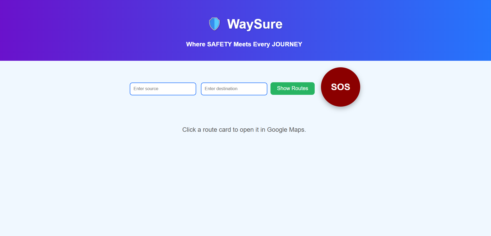
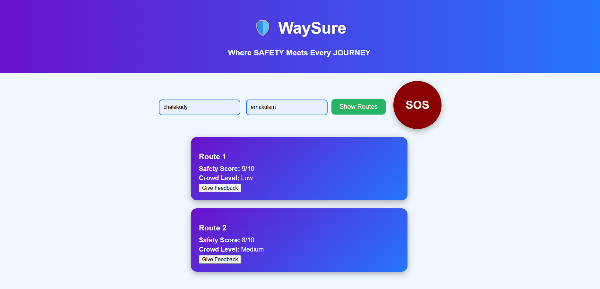
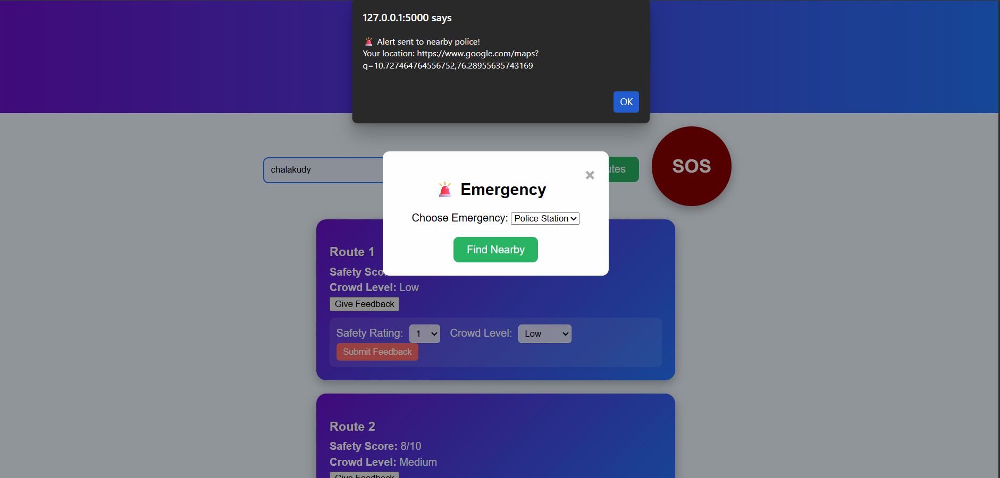
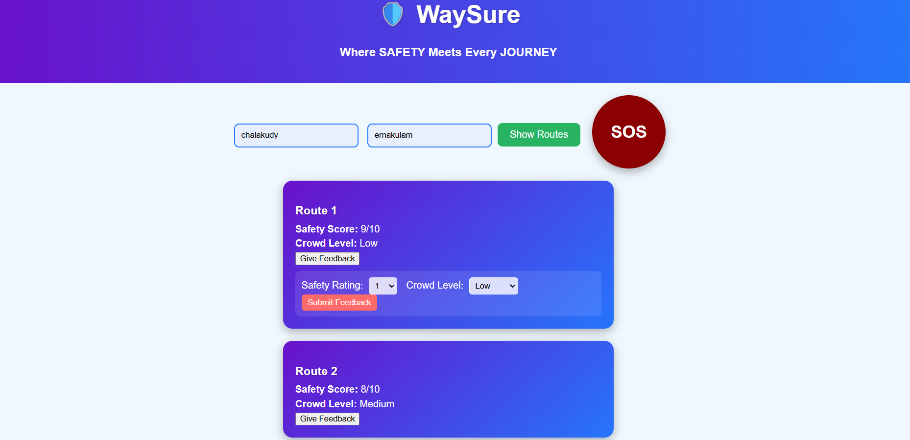
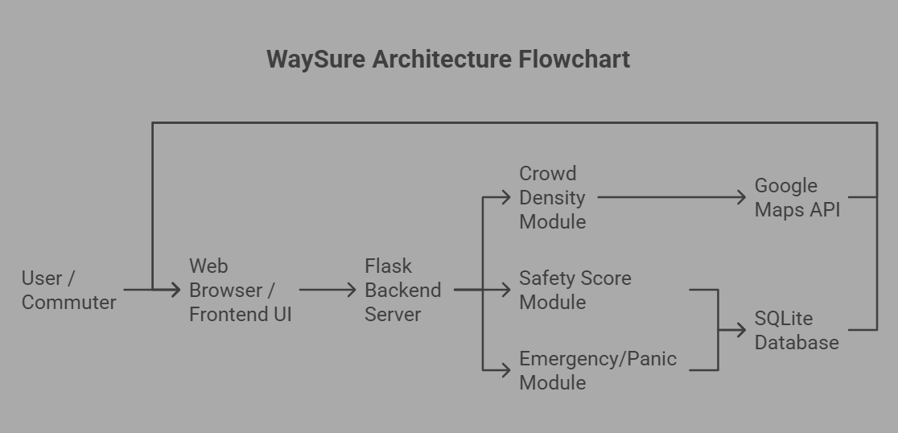
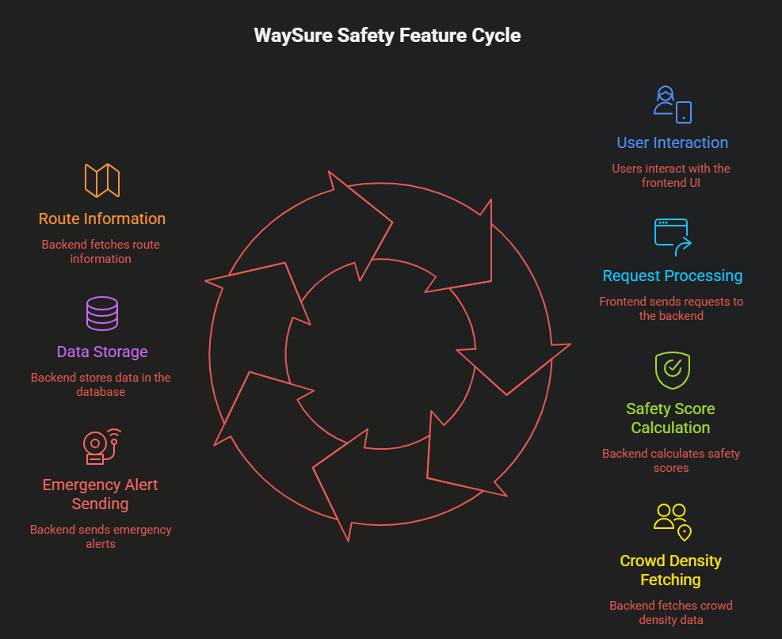

<p align="center">
  
</p>

# WaySure 🛡️

## Basic Details

### Team Name: Tech Divas

### Team Members:
- Member 1: Ann Mary Joseph - Jyothi Engineering College
- Member 2: Anjana P S- Jyothi Engineering College

### Hosted Project Link:
[https://tink-her-hack-temp-wk7i.onrender.com]

### Project Description:
WaySure is a smart web platform that helps users choose safer travel routes, not just the fastest ones. It compares routes based on safety score, crowd density, time, and distance using factors like road type, lighting, and time of day, enabling informed and confident commuting decisions.

### The Problem statement:
Current navigation systems optimize for speed, not safety. 
WaySure introduces a Safety Intelligence Layer on top of existing map services to make commuting smarter and safer.

### The Solution:
WaySure provides interactive route options with safety metrics, allowing users to select the safest route in addition to the fastest route. Routes can be compared based on:

-Safety score (based on road type, lighting, and time)

-Crowd density

-Estimated travel time

-Distance

## Technical Details:

### Technologies/Components Used:

**For Software:**
- Languages used: HTML, CSS, JavaScript, Python 
- Frameworks used:Flask 
- Libraries used:Google Maps Embedded API
- Tools used: Notepad / Git / GitHub / Web Browser

**For Hardware:**
- None

---

## Features

List the key features of your project:
- Feature 1: Display multiple routes between two points with safety and crowdedness metrics
- Feature 2: Route selection based on user preference (safest, fastest, or balanced)
- Feature 3: Interactive embedded Google Maps view for selected route
- Feature 4: Dashboard showing safety insights and crowd density
- Feature 5: Smart Panic Assistance Module with emergency alerts

---

## Implementation

### For Software:

#### Installation
```bash
# Python backend dependencies
pip install -r requirements.txt

# Flask (if used)
pip install flask

```

#### Run
```bash
# Run the Flask app
python3 app.py

```

### For Hardware:

#### Components Required:
none

#### Circuit Setup:
none

---

## Project Documentation

### For Software:

#### Screenshots (Add at least 3)

1. Homepage Input Section:
  
*This screenshot shows the source and destination input fields along with the "Show Routes" button and the red SOS panic button.*


2. Route Cards After Clicking Show Routes:
  
*After clicking "Show Routes", multiple route cards appear dynamically showing Safety Scores and Crowd Levels for each available route.*


3. Panic Button Modal:
  
*Clicking the SOS panic button opens this emergency modal, allowing the user to choose nearby Police, Hospital, or Fire Station for alerting.*

4. Feedback Submission
  
*This screenshot shows a route card with the feedback section expanded, where users can select Safety Rating and Crowd Level and submit their feedback.*

#### Diagrams

**System Architecture:**


*Web-based platform using Flask backend, SQLite database, and Google Maps API to compute and display safety metrics.*

**Application Workflow:**


*The application workflow: Users enter their source and destination, the system computes the Safety Score and Crowd Density for available routes, displays interactive route cards, and allows users to select a preferred route while providing real-time navigation and integrated emergency support.*

---

### For Hardware:

#### Schematic & Circuit

     none
#### Build Photos

     none

---

## Additional Documentation

### For Web Projects with Backend:

#### API Documentation

**Base URL:** `http://127.0.0.1:5000/`

##### Endpoints

**POST /api/endpoint**
- **Description:** [What it does]
- **Request Body:**
```json

{
  "route": "Route 1",
  "safety": "8",
  "crowd": "Low"
}

```
- **Response:**
```json
{
  "status": "success",
  "message": "Feedback submitted successfully"
}
  "status": "success",
  "data": {}
}
```

### For Mobile Apps:(none)

---

### For Hardware Projects:(none)
#### Demo Output

**Example 1: Basic Route Search**

**Input:**
```
Source: ernakulam
Destination: chalakudy

```

**Command:**
```bash
python app.py
```

**Output:**
```
Route 1
Safety Score: 8/10
Crowd Level: Low

Route 2
Safety Score: 6/10
Crowd Level: Medium

```

**Example 2: Feedback submission**

**Input:**

User clicks “Give Feedback” on Route 1.

Selects:

Safety Rating: 9
Crowd Level: Low
```

**Command:**
```bash
python app.py
```

**Output:**
```
Feedback for Route 1 submitted successfully!
Safety Rating: 9
Crowd Level: Low
---
```
#### Project Demo

### Video

[Waysure.mp4]

*1. Homepage & Input Section

Displays source and destination input fields.

Provides a green “Show Routes” button to fetch available routes.

Shows a red circular SOS panic button for emergencies.

Users enter starting and ending locations to get route options.

2. Show Routes Functionality

When “Show Routes” is clicked:

The system dynamically generates route cards in the routes section.

Each card displays:

Route Name

Safety Score (1–10)

Crowd Level (Low/Medium/High)

Feedback section can be toggled for each card to submit:

Safety Rating

Crowd Feedback

Clicking a route card opens Google Maps in a new window showing the selected route.

3. Route Cards

Routes are displayed only after clicking “Show Routes” — no duplicates.

Each card has:

Interactive feedback div hidden by default.

A “Give Feedback” button to toggle the feedback form.

Feedback submission sends data to backend using a POST request.

4. Embedded Panic Button

Clicking the SOS panic button opens a modal.

Modal allows the user to select emergency type:

Police Station

Hospital

Fire Station

Clicking “Find Nearby”:

Uses the browser’s geolocation to get user’s current location.

Alerts the chosen emergency service (currently simulated with an alert showing a Google Maps link with the user’s location).

5. Google Maps

Instead of using an API key (to avoid limitations):

Each route card opens Google Maps directions in a new tab/window with the selected source and destination.

The embedded map section shows a placeholder message: “Click a route card to open it in Google Maps.”

6. Styling (CSS)

Modern, colorful, and interactive:

Gradient route cards stacked vertically.

Circular red SOS button for panic.

Feedback dropdowns and buttons styled clearly for usability.

Input fields and buttons have hover effects for interactivity.*

### Additional Demos[none]
[Add any extra demo materials/links - Live site, APK download, online demo, etc.]

---

## AI Tools Used:


**Tool Used:** 

ChatGPT: Refined project abstract, drafted documentation, created captions, and structured content for competition submission.
Claude AI: Assisted in summarizing technical concepts, generating structured documentation, and reviewing content clarity.
Napkin.ai: Designed architecture and application workflow diagrams for clear visualization.

**Purpose:** 

ChatGPT & Claude AI: Refined documentation, structured abstract, drafted captions, and summarized technical content for clarity.
Napkin.ai: Created professional architecture and workflow diagrams to visualize system design and user journey.

**Key Prompts Used:**

Design a system architecture diagram showing data flow from user to Google Maps API
Draft a concise workflow diagram for user journey from route selection to emergency alert
Summarize technical project details into documentation

**Percentage of AI-generated code:** Approximately 15–20%

**Human Contributions:**

- Architecture design and planning
- Custom business logic implementation
- Integration and testing
- UI/UX design decisions

*Note: Proper documentation of AI usage demonstrates transparency and earns bonus points in evaluation!*

---

## Team Contributions

 Ann Mary Joseph: Backend development, Google Maps integration, UI/UX design, and route card visualization.
 
 Anjana P S: Frontend development,Panic Module implementation and integration.

---

## License

This project is licensed under the [LICENSE_NAME] License - see the [LICENSE](LICENSE) file for details.

**Common License Options:**
- MIT License (Permissive, widely used)
- Apache 2.0 (Permissive with patent grant)
- GPL v3 (Copyleft, requires derivative works to be open source)

---

Made with ❤️ at TinkerHub
